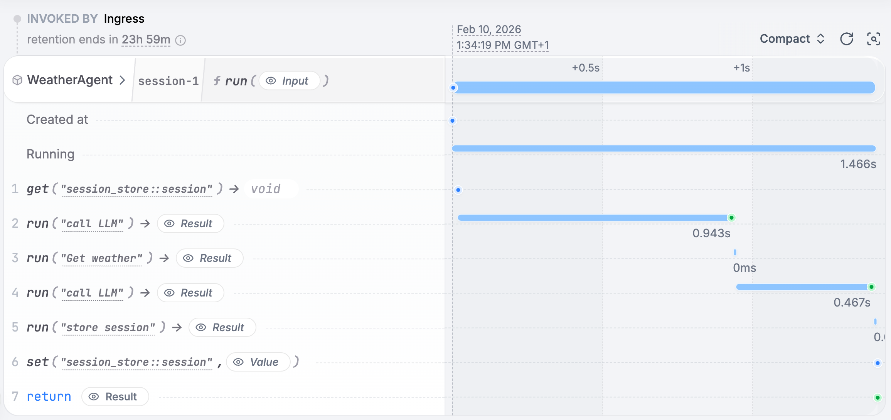

# Restate Plugin for Google ADK

Build durable, failure-resistant AI agents with [Google ADK](https://google.github.io/adk-docs/) and [Restate](https://restate.dev/).

## What Does Restate Add to Your ADK Agents?
With Restate, your AI agents can:
- ✅ **Never lose progress** - if your agent crashes, it picks up exactly where it left off
- ✅ **Handle failures gracefully** - automatic retries, timeouts, and error recovery
- ✅ **Wait for human approval** - pause execution for days/weeks until a human approves
- ✅ **Store context safely** - agent memory persists across restarts with built-in session management
- ✅ **Run complex workflows** - orchestrate multiple agents, run tasks in parallel
- ✅ **Complete observability** - see exactly what your agent did and when
- ✅ **Task control** - kill, pause and resume execution at any time
- ✅ **Safe versioning** - never break ongoing executions with immutable deployments and version-aware routing

Watch the intro video:

[](https://www.youtube.com/watch?v=TkGFdildEXk)

## Installation

Install the Restate SDK (includes the ADK plugin):

```bash
pip install restate-sdk[serde]
```

Start the Restate server:

```bash
docker run --name restate --rm -p 8080:8080 -p 9070:9070 \
  --add-host host.docker.internal:host-gateway \
  docker.restate.dev/restatedev/restate:latest
```

Other install methods: [Brew, npm, binary downloads](https://docs.restate.dev/develop/local_dev#running-restate-server--cli-locally)

## Quick Start

This minimal example creates a durable weather agent. The full code is in [`examples/hello-world/agent.py`](examples/hello-world/agent.py).

```python
import restate
from google.adk import Runner
from google.adk.agents.llm_agent import Agent
from google.adk.apps import App
from google.genai.types import Content, Part
from restate.ext.adk import RestatePlugin, RestateSessionService, restate_object_context


async def get_weather(city: str) -> str:
    """Get the current weather for a city."""
    async def fetch_weather() -> str:
        # Call weather API, database, or any external service
        return f"The weather in {city} is sunny, 72°F"

    # Durable execution: automatically retries and recovers on failure
    return await restate_object_context().run_typed("Get weather", fetch_weather)


agent = Agent(
    model="gemini-2.5-flash",
    name="weather_agent",
    instruction="You are a helpful weather assistant.",
    tools=[get_weather],
)

app = App(name="weather", root_agent=agent, plugins=[RestatePlugin()])
runner = Runner(app=app, session_service=RestateSessionService())

weather_service = restate.VirtualObject("WeatherAgent")

@weather_service.handler()
async def run(ctx: restate.ObjectContext, message: str) -> str | None:
    events = runner.run_async(
        user_id=ctx.key(),
        session_id="session",
        new_message=Content(role="user", parts=[Part.from_text(text=message)]),
    )
    final_response = None
    async for event in events:
        if event.is_final_response() and event.content and event.content.parts:
            if event.content.parts[0].text:
                final_response = event.content.parts[0].text
    return final_response
```

### Run it

**1. Export your Google API key**

```bash
export GOOGLE_API_KEY=your-api-key
```

Get a free key from [Google AI Studio](https://aistudio.google.com/app/api-keys).

**2. Start the agent**

```bash
cd examples/hello-world
uv run .
```

**3. Start Restate**

```bash
docker run --name restate --rm -p 8080:8080 -p 9070:9070 \
  --add-host host.docker.internal:host-gateway \
  docker.restate.dev/restatedev/restate:latest
```

**4. Register the agent and send a request**

```bash
# Register the agent with Restate
curl localhost:9070/deployments --json '{"uri": "http://host.docker.internal:9080"}'
```
```bash
# Send a request
curl localhost:8080/WeatherAgent/session-1/run \
  --json '"What is the weather in New York?"' 
```

**5. View what happened in Restate UI**

Navigate to `http://localhost:9070` and click on the Invocation tab and then on your invocation to see the execution journal.



## Capabilities

| Capability | API | Description |
|---|---|---|
| Durable tool execution | `restate_object_context().run_typed()` | Wraps tool logic so it retries and recovers automatically |
| Human-in-the-loop | `restate_object_context().awakeable()` | Pauses execution until an external signal (e.g. human approval) |
| Persistent sessions | `RestateSessionService()` | Agent memory and conversation state survive restarts |
| Durable LLM calls | `RestatePlugin()` | LLM calls are journaled with automatic retries |
| Multi-agent communication | `ctx.service_call()` | Durable cross-agent HTTP calls with guaranteed delivery |
| Parallel execution | `restate.gather()` | Run tools/agents concurrently with deterministic recovery |

## Advanced example: insurance agent
See the [insurance example](examples/insurance/) for a more complex agent with pausing the agent during human approval.

## Learn More

- [Google ADK + Restate tutorial](https://docs.restate.dev/tour/google-adk) - Step-by-step guide to building durable agents
- [Restate AI documentation](https://docs.restate.dev/ai) - Full reference for AI agent patterns
- [Google ADK documentation](https://google.github.io/adk-docs/) - Google's Agent Development Kit docs
- [More examples](https://github.com/restatedev/ai-examples) - Multi-agent systems, parallel execution, and more
- [Discord](https://discord.gg/skW3AZ6uGd) / [Slack](https://join.slack.com/t/restatecommunity/shared_invite/zt-2v9gl005c-WBpr167o5XJZI1l7HWKImA)- Get help and share what you're building
