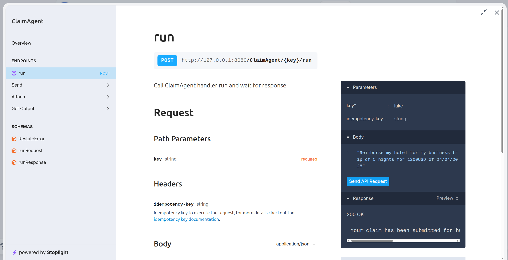

# Restate + Google ADK Example

**This integration is work-in-progress.**

AI agent examples using [Restate](https://docs.restate.dev/ai) for durable execution and [Google Agent Development Kit](https://google.github.io/adk-docs/) for AI workflows.

## Features
Restate makes AI agents and workflows innately resilient. Restate provides the reliability infrastructure you need to run AI workloads in production - from simple LLM chains to complex multi-agent systems.

Restate makes building AI workflows and agent easy:
- ✅ Recovery from failures: never lose agent progress
- ✅ Built-in session management: store context in Restate’s K/V store
- ✅ Complete observability: trace every decision and fine-grained steps in tool executions
- ✅ Human approvals and long-running workflows: pause for approvals, feedback, or data input
- ✅ Resilient communication for multi-agent systems
- ✅ Task orchestration: parallelization, pause/cancel/kill tasks, racing agents,...
- ✅ Timeouts, rollbacks, custom logic, and more

Whether you’re building chatbots, autonomous agents, or AI-powered workflows, Restate handles the complexity of distributed execution so you can focus on your AI logic.

## Prerequisites
- [Docker](https://www.docker.com/get-started/)
- [uv](https://uv.run/getting-started/installation)
- [Google API key](https://aistudio.google.com/app/api-keys)
- Python 3.11+

## Quick Start

Export your Google API key:
```bash
export GOOGLE_API_KEY=your-key
````

Run the application:
```bash
uv run . 
```

The agent runs on `http://localhost:9080`

Start Restate:
```bash
docker run --name restate_dev --rm \
-p 8080:8080 -p 9070:9070 -p 9071:9071 \
--add-host=host.docker.internal:host-gateway \
docker.restate.dev/restatedev/restate:latest
```

Go to the Restate UI at `http://localhost:9070`. Click on `register deployment`. And fill in the agent url `http://host.docker.internal:9080`.


Click on the `run` handler of the `ClaimAgent` service and send a request for less than 1000USD, for example:
`"Reimburse my hotel for my business trip of 5 nights for 800USD of 24/04/2025"`
In the key field, fill in a session ID:



In the invocations tab, you see the execution journal when clicking on the invocation ID:


## Try out Durable Execution with a human approval example

You can try out durable execution with a human approval example. Send a request for more than 1000USD, for example:
`"Reimburse my hotel for my business trip of 5 nights for 1500USD of 24/04/2025"`

While the agent is running, you can kill it (CTRL+C) and restart it, and the execution will resume from where it left off.

In the invocations tab, you see that the agent is waiting for human approval:


To approve the request, copy over the curl command that was printed in the service logs, and run it in your terminal. For example:
```bash
curl localhost:8080/restate/awakeables/sign_.../resolve --json 'true'
```

After approval, the agent will continue its execution and complete the reimbursement process.